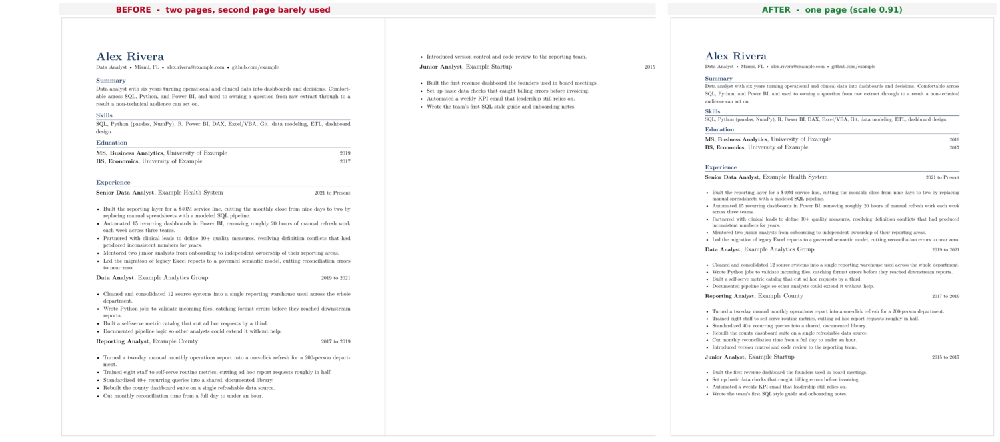

# resume-tex-fit

[](https://github.com/hihipy/resume-tex-fit/actions/workflows/links.yml)
[](https://creativecommons.org/licenses/by-nc-sa/4.0/)

**Built with**

[](https://python.org)
[](https://www.latex-project.org)
[](https://github.com/jsvine/pdfplumber)
[](https://docs.python.org/3/library/tkinter.html)

Fit a LaTeX resume, CV, or any document to an exact page count. It drives the whole document off one scaling value, then finds the tightest setting that still fits, so your last page fills up instead of spilling a few lines onto the next one.

---

## The Problem

A resume that almost fits is its own kind of annoying. You write two solid pages, and three stray lines push onto a third. Or you trim too hard and the second page sits half empty. Either way you end up hand-tuning font sizes and margins, recompiling, and eyeballing the result over and over.

The usual fixes all have a catch:

- **Manual resizing:** Nudging one font size shifts everything downstream, so you chase the overflow around the document.
- **Shrinking the whole thing:** Scaling type down to force a page count often lands on a size that is too small to read or that an applicant tracking system mishandles.
- **Padding to fill:** Inflating type or adding filler to fill a short page reads as exactly what it is.
- **No repeatability:** However you got it to fit this time, you have to redo the fiddling next time you edit a bullet.

---

## The Solution

`resume-TeX-fit` turns page fitting into one search. Your document exposes a single scaling command, `\newcommand{\rs}{1.000}`, and every font size, line spacing, and gap is computed from it. The tool edits that number, compiles with `xelatex`, reads the page count from the log, and searches for the largest scale that still fits your target. Fitting to the largest scale means the last page fills as much as it can without spilling.

It checks feasibility against the document's natural size, not against the scale ceiling, so a longer target does not pad a short resume by inflating type unless you turn on Force Fit. Three outcomes, covered in detail below: it fits, it is too long, or it is too short.

### Why a Single Script?

- **No setup:** The core fit uses only the Python standard library. Run it with one command. Nothing to install past a working LaTeX distribution.
- **CLI or GUI:** Drive it from the terminal for scripting, or open a small window with a file picker if you would rather click.
- **One job:** It fits a document to a page count and reports honestly when it cannot. It does not try to be a full build system.

---

## New to LaTeX?

If you already know LaTeX, skip to the next section. If you have only used Word or Google Docs, here is the whole idea.

**LaTeX** (say "lay-tek") is a typesetting system built on TeX, the engine Donald Knuth wrote in the late 1970s to set mathematics well. Instead of formatting by clicking buttons, you write plain text mixed with commands that describe structure, then a program turns that into a finished PDF. You write `\section{Experience}` and `\textbf{Senior Analyst}`, and LaTeX decides the exact spacing, alignment, and line breaks.

The difference from Word is the point. Word shows you the formatted page and you nudge it by hand. LaTeX has you describe what each piece of text is, then lays it out consistently. You give up live visual editing, and in return you get output that looks typeset, spacing that stays uniform across the document, and a plain-text file you can version-control and diff.

The pieces you actually touch:

- **The `.tex` file** is your document, plain text you can open in any editor.
- **A compiler** reads the `.tex` and produces a **`.pdf`**, plus side files (`.aux`, `.log`) you can ignore or gitignore.
- **`xelatex`** is the compiler flavor this tool uses. It handles modern system fonts and Unicode cleanly. It ships with TeX Live (Windows, Linux) and MacTeX (Mac). Check it with `xelatex --version`.

**The scaling knob, in plain terms.** In a normal LaTeX resume each size is a fixed number: body text is 10 point, a heading is 12, a gap is 6. In a document built for this tool, each of those is written as "a base number times `\rs`." So `\rs` at 1.0 gives the normal sizes, 0.95 shrinks everything 5 percent, 1.03 grows it 3. That one number scales the whole document, and it is the only thing the tool turns.

---

## The One Requirement: the `\rs` Knob

This is the hard dependency. The tool does not parse your layout or resize elements one by one. It turns `\rs` and recompiles. If your `.tex` does not route its sizing through `\rs`, there is nothing to turn and the tool refuses to run.

Wiring it up is a few lines in the preamble. You need the `xfp` package for the arithmetic, the knob itself, and two small helpers so the rest of the document never writes a raw size:

```latex
\usepackage{xfp}                         % \fpeval for inline arithmetic

% The one knob resume-TeX-fit turns. Keep it at 1.000 in source; the tool sets it.
\newcommand{\rs}{1.000}

% \fs{size}{leading} selects a font size and line spacing, both scaled by \rs.
\newcommand{\fs}[2]{\fontsize{\fpeval{#1*\rs}}{\fpeval{#2*\rs}}\selectfont}

% \sv{pt} inserts vertical space scaled by \rs.
\newcommand{\sv}[1]{\vspace{\fpeval{#1*\rs}pt}}

% Scaled length registers for package options that need a real length.
\newlength{\Lsecabove}\setlength{\Lsecabove}{\fpeval{7.5*\rs}pt}
\newlength{\Litemsep}\setlength{\Litemsep}{\fpeval{1.6*\rs}pt}
```

From there, body text uses `\fs{10}{11.7}`, a section gap uses `\sv{6}`, list spacing pulls from `\Litemsep`, and every size traces back to `\rs`. The repo ships `demo.tex`, a minimal knob-wired resume that compiles with the default fonts (no `fonts/` folder), so you can try the tool right after cloning:

```bash
python3 resume-tex-fit.py demo.tex --pages 1
```

That compresses it onto one clean page (it runs onto a second page at normal size). Try `--pages 2` to keep its natural two pages instead. The full before and after is in the next section.

If you would rather not hand-write any of this, the next section has an AI do it for you.

---

## What a Run Looks Like

The shipped `demo.tex` is deliberately overloaded: at normal size it runs onto a second page. Target one page:

```bash
python3 resume-tex-fit.py demo.tex --pages 1
```



It binary-searches the density and locks the largest scale that still holds one page:

```
Fitting demo.tex to 1 page(s) (scale range 0.90-1.05):
  scale 1.0000 -> 2 page(s)
  scale 0.9000 -> 1 page(s)
  scale 0.9500 -> 2 page(s)
  scale 0.9250 -> 2 page(s)
  scale 0.9125 -> 2 page(s)
  scale 0.9062 -> 1 page(s)
  scale 0.9094 -> 1 page(s)
  scale 0.9064 -> 1 page(s)

Locked scale 0.9064 -> 1 page(s). Backup saved as demo.tex.bak.
```

The only edit it makes to your `.tex` is the one knob:

```diff
-\newcommand{\rs}{1.000}
+\newcommand{\rs}{0.9064}
```

Every size, line height, and gap recomputes from that value, so the whole document tightens by the same proportion instead of one part getting cramped. The original is saved as `demo.tex.bak` next to it, and `debug/` holds more documents to try, including a two-column layout, an academic CV, and a few edge cases.

---

## Bring Your Own Resume: Convert It With AI

If you have a resume in Word, Docs, or a PDF, you do not need to learn LaTeX or wire the knob by hand. A general model (Claude, ChatGPT, Gemini) converts it reliably, but only if you hand it the knob machinery and tell it to route everything through it. A plain "convert my resume to LaTeX" request produces hardcoded sizes the tool cannot touch. The prompt below forces every size through `\rs`.

### Why Convert at All

**What you get:**

- **Exact page control:** You hit two pages, not two pages plus three orphaned lines, and the last page looks full.
- **Retarget without rewriting:** Change the `--pages` number and rerun. The knob retunes density; you do not touch a word.
- **Typeset quality:** Consistent spacing and alignment that word processors do not match.
- **Plain-text source:** Version control, clean diffs, and a PDF you can regenerate identically.
- **ATS-friendly when built right:** Selectable text and standard section names parse cleanly through applicant tracking systems.

**What it costs:**

- **A real dependency:** You need `xelatex` installed to compile.
- **Proofreading is on you:** AI conversion drops bullets, mangles special characters, and occasionally invents a detail. Read every line against your original.
- **Not every template converts cleanly:** Single-file `article`-class templates rewire through one knob without a fight. Class-based templates (the ones that load a `.cls`) hide their sizing inside the class, where the knob cannot reach.

### Step 1: Pick a Look

Browse a few real, open-source `.tex` templates, decide on a style, then have the AI reproduce that look in the knob-wired structure. Everything below is a repository you can clone and read, not a hosted editor.

For this tool, favor the **article-class, single-file** templates (Jake's, sb2nov, latexcv, rover-resume). Their sizing lives in the preamble where the knob can drive it. The **class-based** ones (AltaCV, Awesome-CV, moderncv, Deedy) are better used as visual reference, since their sizing is locked inside a `.cls`.

| Template | What it is | License | Source |
| --- | --- | --- | --- |
| Jake's Resume | Single-file, single-column, dense, ATS-friendly. The most convertible of the popular ones. | MIT | `github.com/jakegut/resume` |
| sb2nov/resume | Clean single-column, a de facto standard in tech, easy to start from. | MIT | `github.com/sb2nov/resume` |
| latexcv | A collection of several self-contained styles; needs only a minimal TeX Live. | MIT | `github.com/jankapunkt/latexcv` |
| rover-resume | Minimal `article`-class, roughly ten lines to start, no custom class to learn. | CC BY 4.0 | `github.com/subidit/rover-resume` |
| AltaCV | Two-column designed CV, class-based. Strong visual reference. | LPPL 1.3+ | `github.com/liantze/AltaCV` |
| Awesome-CV | Polished, icon fonts, matching cover letter. Class-based. | Class LPPL 1.3c; template CC BY-SA 4.0 | `github.com/posquit0/Awesome-CV` |
| moderncv | Five built-in styles, class-based, distributed on CTAN. | LPPL 1.3c | `ctan.org/pkg/moderncv` |
| Deedy-Resume | Dense two-column, one page, Lato and Raleway fonts. Opinionated. | Apache 2.0 | `github.com/deedy/Deedy-Resume` |

For a wider hunt:

- **Curated list:** `github.com/smortezah/awesome-cv` collects templates and generators across LaTeX, Typst, and others.
- **GitHub topics:** browse hundreds and filter by license at `github.com/topics/latex-resume-template` and `github.com/topics/latex-cv-template`.

Licenses vary and can change, and forks often differ from the original. Confirm the license in the repo before you reuse or redistribute a template.

### Step 2: Convert With This Prompt

Paste this into your AI of choice and fill the four bracketed fields. It hands the model the exact knob setup and requires everything to route through it, which is what makes the output compile and fit.

```text
You are converting my resume into a single self-contained LaTeX file that compiles with xelatex. The file will be fed to a tool called resume-TeX-fit, which fits the document to a target page count by turning ONE scaling knob. For that to work, every font size, line spacing, and vertical space MUST be computed from that knob. Follow these rules exactly.

1. Include this machinery verbatim in the preamble and route ALL sizing through it. Do not hardcode any font size or vertical space that bypasses \rs.

   \usepackage{xfp}
   \newcommand{\rs}{1.000}
   \newcommand{\fs}[2]{\fontsize{\fpeval{#1*\rs}}{\fpeval{#2*\rs}}\selectfont}
   \newcommand{\sv}[1]{\vspace{\fpeval{#1*\rs}pt}}

   Use \fs{size}{leading} for every size change, \sv{pt} for every manual vertical space, and \fpeval{VALUE*\rs} inside any package option or length that takes a measurement. Leave \rs at exactly 1.000 in your output; the tool sets it, not you. Do not hand-tune sizes to hit a page count.

2. Use only the content I give you below. Do not invent employers, titles, dates, metrics, or achievements. If something is ambiguous or missing, leave a % TODO comment rather than guessing.

3. Escape LaTeX special characters in all content: & % $ # _ { } ~ ^ and backslash. Keep real dollar figures as \$ (for example, \$540M).

4. Keep it ATS-friendly: single column, selectable text, standard section headings via \section, no text rendered as an image, no layout tables. Standard section names (Summary, Experience, Education, Skills, Projects) help both parsers and the tool's checks.

5. Font: set the main font with fontspec to [FONT NAME, or write "the default" to skip fontspec and use Latin Modern so it compiles with no extra files]. Use a single accent color, [ACCENT COLOR as a hex value, for example 1A365D], for the name, section headers, and rules.

6. Aim the layout at roughly [TARGET PAGES] page(s) at normal size, but do not force it; resume-TeX-fit will tighten or relax the fit.

Output ONLY the complete .tex file in one code block, with no explanation before or after.

Here is my resume content:
[PASTE YOUR RESUME TEXT HERE]
```

Save the result as `myresume.tex` next to `resume-tex-fit.py`. If you told the model to use a local font, drop the font files in a `fonts/` folder beside the `.tex` and point `fontspec` at them; the default font needs nothing extra.

### Step 3: Check the Output

The model gets you most of the way. The rest is on you, because this is a resume.

- **Compile it and read the PDF against your original.** Watch for dropped bullets, reordered dates, and numbers that do not match.
- **Scan for `% TODO` comments.** Those mark where the model was unsure.
- **Check special characters.** Percentages, dollar signs, ampersands in company names, and underscores in emails are the usual breakage points.
- **Confirm the knob is used.** The tool refuses a file with no `\rs`, but it cannot catch a stray `\fontsize{11pt}` that slipped past the knob. A search for raw `pt` sizes finds those.

---

## Features

- **Exact page fitting:** Binary-searches the scale range for the largest setting that still fits your target page count.
- **Feasibility check:** Judges the target against the document's natural size, so it does not pad a short document by default.
- **Document-type targets (GUI):** Pick Junior (1 page), Senior or Executive (2 pages), or Academic CV (fits its natural length) instead of a raw page number.
- **Force Fit (opt-in):** When the content does not fit the target, grow past the normal range or shrink below the readable floor to hit it anyway, with a plain warning about the cost.
- **Three honest outcomes:** Fits, too long, or too short, each with a clear report and next step.
- **Cut guidance when too long:** Estimates the overflow and suggests where to trim, ordered easiest to hardest.
- **Choose where the PDF goes:** The GUI asks for the output folder and name before running; the CLI takes `--out`.
- **Backup and restore:** Writes a `.tex.bak` before any change and restores it if the target is not reachable.
- **Follows your OS theme:** The GUI reads your light or dark setting on launch.
- **Responsive GUI:** `xelatex` runs on a background thread so the window does not freeze.

---

## Getting Started

Put the script, your `.tex`, and (if the document loads local fonts) a `fonts/` folder in the same directory.

### Requirements

- **`xelatex` on your PATH.** The one hard requirement. Ships with TeX Live and MacTeX. Check with `xelatex --version`.
- **Python 3.8 or newer.** Standard library only for the core fit.
- **`pdfplumber` (optional).** If installed, the "too long" advice gives a line-level overflow estimate instead of a coarse page-based one. Install with `pip install pdfplumber`.
- **`tkinter` (optional, GUI only).** Bundled with most Python installs. On some Linux builds it is a separate `python3-tk` package.

### CLI

```bash
python3 resume-tex-fit.py resume.tex --pages 2
python3 resume-tex-fit.py resume.tex --pages 1 --force --out ~/Desktop/resume.pdf
python3 resume-tex-fit.py cv.tex --pages 0            # 0 = fit to natural length
```

`--pages` is the target (default 2); `0` fits to the document's natural length, for a CV. `--force` grows or shrinks past the normal range to hit the target even when the content does not fit, and warns about the cost. `--out PATH` copies the fitted PDF to PATH after a successful run. `--min` and `--max` set the scale range (defaults 0.90 and 1.05); lower `--min` for smaller type, raise `--max` for larger.

### GUI

```bash
python3 resume-tex-fit.py           # opens the GUI
python3 resume-tex-fit.py --gui
```

Pick a `.tex`, choose a document type, and hit Fit. On Fit it asks where to save the fitted PDF, then runs and writes it there on success. Turn on **Force Fit** first if you want it to hit the target even when the content does not fit. Every message, the knob check, fit progress, outcomes, and errors, prints to the output pane so you can select and copy it; there is no separate status bar. The window follows your OS light or dark theme, and `xelatex` runs on a background thread so it stays responsive.

---

## The Three Outcomes

- **Fits.** The tool searches the scale range, backs off the boundary slightly so a later reflow cannot push you over, locks that scale, and reports it. A `.tex.bak` is saved first so you can revert.
- **Too long.** If the document still overflows at the smallest normal density, the tool estimates the overflow (in lines, if `pdfplumber` is installed) and gives options ordered easiest to hardest, ending with Force Fit. Left alone, it restores your file and changes nothing. With Force Fit on, it shrinks below the readable floor to hit the target, or reverts and tells you the content is too dense if even that cannot reach it.
- **Too short.** If the content does not reach the target at normal size, the tool reports what it fills and declines to pad. With Force Fit on, it grows the type to reach the target (which reads as padding), or reverts and tells you the content is too sparse if even the ceiling cannot reach it.

---

## Limitations

- **The `\rs` knob is mandatory.** Pointing the tool at an arbitrary `.tex` without it will not work, by design.
- **The search assumes page count rises with scale.** It almost always does, but LaTeX reflow can occasionally shuffle a widow or float across a page boundary and break that assumption. On a pathological document the fit can be off by a page; a rerun after a small edit usually resolves it.
- **Each fit runs `xelatex` several times.** A search compiles repeatedly. The tool caches page counts per scale to avoid recompiling the same setting twice, but expect a run to take as long as several `xelatex` passes on your document.
- **The GUI render is not verified on every platform.** The logic and thread handling are tested; the exact window appearance varies by OS and theme.

---

## License

This project is licensed under [CC BY-NC-SA 4.0](https://creativecommons.org/licenses/by-nc-sa/4.0/).

You are free to:

- Use, share, and adapt this work
- Use it at your job

Under these terms:

- **Attribution:** Credit the original author
- **NonCommercial:** No selling or commercial products
- **ShareAlike:** Derivatives must use the same license
